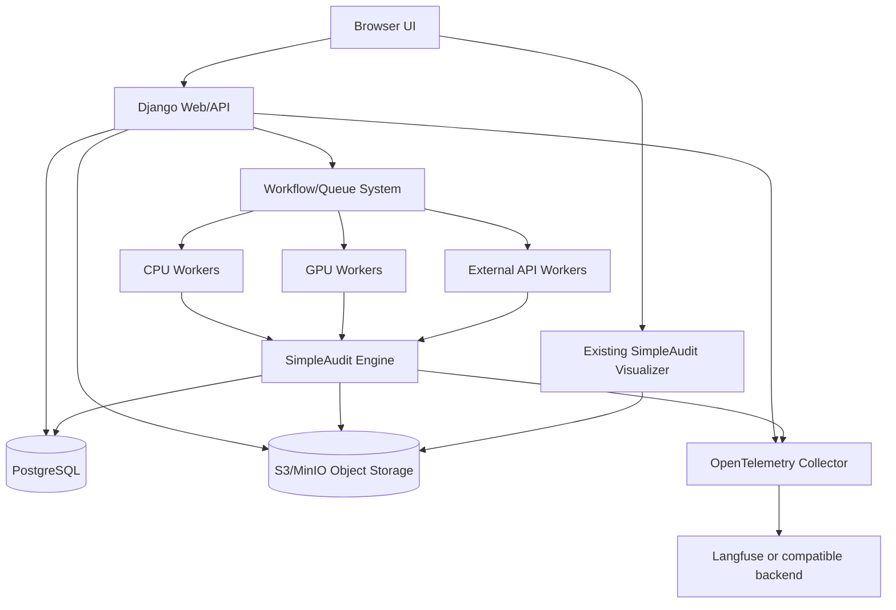

# SimpleAudit Studio — Architecture

Status: Phase 0 draft for independent review  
Date: 2026-09-22  
Owner: Architecture role  
Related ADRs: `docs/adr/`

## 1. Goals

The production platform must be:

- self-hostable with Docker Compose
- durable across web/API and worker restarts
- safe for long-running and GPU-backed jobs
- observable end to end
- reproducible at the audit level
- maintainable by multiple developers
- simple enough that one host can run the full system

It must wrap the existing SimpleAudit engine rather than reimplement its scientific pipeline.

## 2. Non-goals

Do not introduce unless measured requirements demand it:

- Kubernetes
- Kafka
- Elasticsearch
- ClickHouse
- lakeFS
- service mesh
- microservice decomposition of every domain object
- custom queue implementation when a mature workflow system fits

## 3. High-level topology



### Component responsibilities

| Component | Responsibility | Must not do |
|---|---|---|
| Django Web/API | authentication, authorization, forms, REST/SSE, validation, orchestration commands | execute long LLM audits in-process |
| PostgreSQL | authoritative state for scenarios, models, runs, metrics, events, users | store raw secrets or large artifacts inline |
| Workflow/queue | durable job scheduling, retries, cancellation, concurrency, worker pools | own SimpleAudit domain truth |
| Workers | execute SimpleAudit target→auditor→judge pipeline | expose public HTTP endpoints |
| Object storage | raw transcripts, result JSON, reports, exports | be queried as primary relational source |
| Observability | traces, logs, metrics, LLM call visibility | replace PostgreSQL audit records |
| Visualizer | deep exploration of saved results | mutate audit state |

## 4. Execution model

### 4.1 Audit lifecycle

An `AuditRun` is a durable aggregate. Its lifecycle is:

```text
queued
  -> preparing
  -> target_execution
  -> auditing
  -> judging
  -> aggregation
  -> report_generation
  -> completed | failed | cancelled
```

The exact stage names may be refined, but progress must be structured state plus counters, not only a percentage.

### 4.2 Job decomposition

Recommended initial decomposition:

1. `audit.run` — top-level workflow for one `AuditRun`.
2. `scenario.execute` — child task per scenario or small batch.
3. `artifact.persist` — upload raw outputs and write result rows.
4. `metrics.aggregate` — compute summary metrics after all scenario tasks finish.

This gives:

- per-scenario retry
- parallelism within a run
- cancellation at run or scenario level
- progress counters from completed child tasks
- recovery after worker death

Execution rule:

Workers must execute exclusively from the frozen snapshots stored on `AuditRun`:

- `target_config_snapshot`
- `auditor_config_snapshot`
- `judge_config_snapshot`
- `generation_parameters_snapshot`
- pinned `ScenarioSetVersion` and its items

Reading live `ModelEndpoint`, `AuditProfile`, or mutable scenario data during
execution is a defect. The only runtime resolution allowed is secret reference
to credential material inside the worker environment.

### 4.3 Worker pools

Workers register labels/capabilities:

- `cpu`
- `gpu`
- `h200`
- `gh200`
- `external-api`
- `local-inference`

Jobs request required capabilities. The web server never needs GPU access.

Concurrency limits are configured per pool:

- global max concurrent audits
- per-run max concurrent scenarios
- per-model endpoint rate limit where known
- GPU worker slot count

### 4.4 Idempotency

Every task receives an idempotency key derived from:

- `audit_run_id`
- `scenario_set_version_item_id`
- attempt number
- task type

Retries must not duplicate final result rows. Final writes use unique constraints and upsert semantics keyed by immutable input identity.

## 5. Data ownership

PostgreSQL is the source of truth for:

- users and roles
- organizations/projects if enabled
- scenarios and revisions
- scenario sets and versions
- model registry entries
- audit runs
- frozen configuration snapshots
- per-scenario results
- metrics
- durable progress events
- comparison definitions
- audit log entries

Object storage holds:

- full SimpleAudit result JSON
- raw conversation transcripts
- judge rationales if large
- exported reports
- imported scenario files
- debug bundles

Hatchet/workflow state is execution state, not the authoritative SimpleAudit database. Langfuse is observability, not the authoritative result store.

## 6. API boundaries

### 6.1 Public API principles

- REST for commands and reads
- SSE for live progress
- OpenAPI generated from serializers/views
- business logic in services, not views
- all mutations authorized
- all IDs opaque or scoped to project
- no raw secrets in responses

### 6.2 Core resources

- `Scenario`
- `ScenarioRevision`
- `ScenarioSet`
- `ScenarioSetVersion`
- `ModelEndpoint`
- `AuditProfile`
- `AuditRun`
- `AuditRunScenario`
- `AuditEvent`
- `Comparison`
- `Artifact`

### 6.3 Event stream

`GET /api/audits/{id}/events` streams durable events from PostgreSQL-backed event table or workflow event bridge.

Events include:

- sequence number
- run ID
- stage
- counters
- message
- timestamp
- trace ID

SSE reconnect uses `Last-Event-ID`; missing events are replayed from durable storage.

## 7. Failure handling

### 7.1 Transient failures

Retry with exponential backoff and jitter for:

- network errors
- provider 429/5xx
- temporary inference timeouts
- object storage transient errors

Retry policy is stored in the run manifest.

### 7.2 Permanent failures

Fail fast for:

- invalid credentials
- model not found
- schema/validation errors
- unsupported provider
- disk/object storage permission errors

The run stores a stable error code and human-readable explanation.

### 7.3 Worker death

If a worker dies:

- workflow marks task failed/timed out
- retry policy applies
- run remains visible
- partial results are marked incomplete
- user can cancel the original run or create a retry run with identical frozen inputs

Retry always creates a new `AuditRun`. The original run remains terminal and
unchanged.

### 7.4 Cancellation

Cancellation is durable and cooperative:

- queued run: mark `cancelled` before workflow start
- running run: update durable `AuditRun.status` and request workflow cancellation
- worker checks durable run state between scenario batches and before each LLM call where feasible
- in-flight HTTP calls may be aborted if client supports it
- final status becomes `cancelled`

The cancellation flag must not exist only in web-process memory. A web restart
must not lose an in-progress cancellation.

## 8. Security architecture

- Django authentication with password hashing
- role-based permissions
- CSRF protection for browser sessions
- CORS restricted to configured origins
- secret references resolved only inside worker process
- signed URLs for artifact access where needed
- SSRF protections for model endpoint registration
- strict output encoding for HTML
- dependency pinning and supply-chain review
- audit logging for admin actions

See `docs/threat-model.md`.

## 9. Observability architecture

Correlation identifiers:

- `request_id`
- `user_id`
- `project_id`
- `audit_run_id`
- `workflow_run_id`
- `task_id`
- `scenario_revision_id`
- `trace_id`
- `span_id`

Traces cover:

- API request
- run creation
- workflow submission
- worker pickup
- target call
- auditor call
- judge call
- artifact upload
- result persistence
- metric aggregation

Metrics:

- queue depth
- worker saturation
- task duration by stage
- LLM latency by role
- token usage by role
- retry counts
- failure codes
- artifact size
- DB query latency

Logs:

- structured JSON
- no secrets
- include correlation IDs
- redact prompts/transcripts by default

## 10. Deployment architecture

Canonical single-host deployment:

```text
docker compose
├── postgres
├── minio
├── hatchet-server
├── hatchet-worker-cpu
├── hatchet-worker-gpu   # optional, same host or remote
├── web
└── collector            # optional
```

Remote workers join by pointing at the same:

- PostgreSQL
- object storage
- workflow server
- observability endpoint

Migrations run in web container startup behind a migration job or command. Automatic data mutation during normal web startup should be limited to schema migrations and safe bootstrapping.

## 11. Compatibility with current prototype

Current prototype provides useful reference behavior:

- domain naming
- scenario versioning concept
- reproducibility manifest idea
- comparison warning concept
- SSE endpoint shape

Current prototype must not become production because it uses:

- SQLite
- in-process queue
- process-local SSE subscribers
- local file artifacts
- no authentication
- no durable event history
- no multi-worker capability

The production status model replaces the prototype’s coarse
`queued|running|completed|failed|cancelled` model. Production uses the staged
lifecycle in §4.1. `AuditRun.status` is the coarse lifecycle state;
`AuditEvent.stage` and event payloads provide fine-grained progress for UI and
diagnostics. The UI should render detailed progress from durable events, while
API consumers may rely on `status` for terminal/coarse state.

## 12. Architectural risks

| Risk | Mitigation |
|---|---|
| Workflow vendor mismatch | ADR compares Hatchet vs alternatives against concrete requirements |
| Long-running LLM jobs time out | per-task timeout, checkpointing, retry, cancellation |
| Progress lost on reconnect | durable event table + Last-Event-ID replay |
| Scenario edits corrupt history | immutable revision/version tables + DB constraints |
| Secrets leak into manifests | snapshot stores references only; worker resolves at execution |
| Comparison misleads users | explicit validity warnings and intersection mode |
| SimpleAudit semantics drift | domain agent owns compatibility tests against existing engine |
| Overengineering | keep one app, Postgres, one workflow system, object storage |
