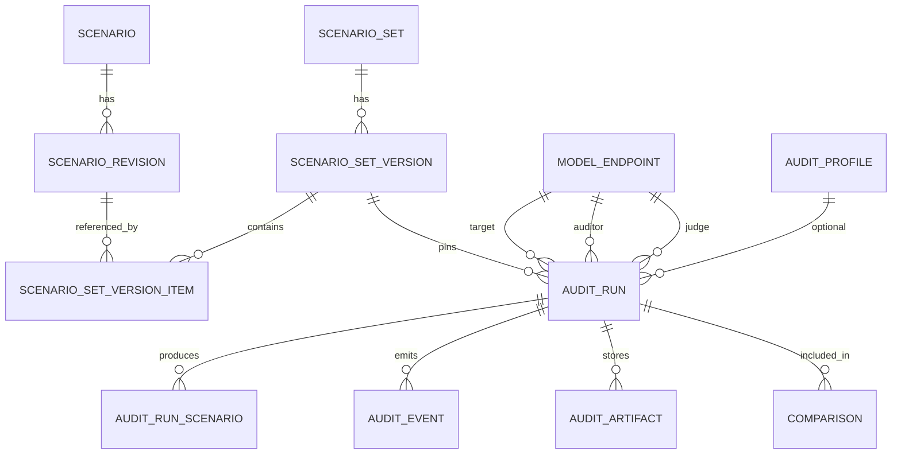

# SimpleAudit Studio — Domain Model

Status: current  
Date: 2026-09-22

## 1. Core invariant

**Every `AuditRun` must reference immutable inputs.**

Once an audit is submitted, its effective scenario content, model configuration, judge profile, generation parameters, engine version, and runtime metadata are frozen. Later edits to scenarios, models, endpoints, or profiles must not alter historical audits.

This invariant must be enforced by schema design and service behavior, not only by convention.

## 2. Entity overview



## 3. Scenario domain

### 3.1 `Scenario`

Identity record for a scenario across revisions.

Fields:

- `id`
- `project_id`
- `key` — stable slug/identity
- `title`
- `category`
- `tags`
- `archived_at`
- `created_by`
- `created_at`
- `updated_at`

Rules:

- `key` is unique within project.
- Archiving does not delete because historical versions may reference it.

### 3.2 `ScenarioRevision`

Immutable content snapshot of a scenario.

Fields:

- `id`
- `scenario_id`
- `revision` — monotonically increasing per scenario
- `description`
- `expected_behavior` — JSON list
- `test_prompt`
- `metadata` — JSON object
- `content_hash`
- `created_by`
- `created_at`

Rules:

- rows are append-only
- no UPDATE path in application API
- `content_hash` covers all fields that affect execution
- duplicate identical content may create a new revision but should be detectable

Execution-relevant metadata:

For MVP, `ScenarioRevision.content_hash` includes:

- `description`
- `expected_behavior`
- `test_prompt`
- `metadata.execution` if present

All other metadata is display/organizational and excluded from the hash unless
explicitly moved under `metadata.execution`. This prevents accidental semantic
changes from labels or UI preferences.

### 3.3 `ScenarioSet`

Named collection of scenarios.

Fields:

- `id`
- `project_id`
- `name`
- `description`
- `created_by`
- `created_at`
- `updated_at`

Rules:

- mutable metadata only
- membership is defined through versions, not direct mutable links

### 3.4 `ScenarioSetVersion`

Immutable published snapshot of a set.

Fields:

- `id`
- `set_id`
- `version` — monotonically increasing per set
- `scenario_count`
- `content_hash`
- `published_by`
- `published_at`

Rules:

- rows are append-only
- `content_hash` is deterministic over ordered items and revision hashes
- audits reference this entity, never `ScenarioSet` directly

### 3.5 `ScenarioSetVersionItem`

Ordered membership of a scenario revision in a set version.

Fields:

- `id`
- `version_id`
- `scenario_id`
- `revision_id`
- `position`

Rules:

- unique `(version_id, scenario_id)`
- unique `(version_id, position)`
- append-only after publish
- position determines execution order if order matters

## 4. Model registry

### 4.1 `ModelEndpoint`

A selectable model resource.

Fields:

- `id`
- `project_id`
- `display_name`
- `provider`
- `base_url`
- `model_id`
- `model_revision`
- `capabilities` — JSON
- `default_parameters` — JSON
- `secret_reference`
- `enabled`
- `created_by`
- `created_at`
- `updated_at`

Rules:

- raw credentials are never stored here
- `secret_reference` names a secret in environment/vault/secret manager
- endpoint changes do not affect existing runs
- display name is user-facing; `model_id` is provider-specific

### 4.2 `SecretReference`

Not necessarily a table initially. It is a named indirection:

```text
SIMULACHAT_API_KEY
OPENAI_API_KEY
LOCAL_INFERENCE_NO_SECRET
```

Production may later add a `Secret` table with encrypted values or external vault IDs, but audit manifests must store only the reference.

## 5. Audit run

### 5.1 `AuditRun`

The scientific experiment record.

Fields:

- `id`
- `project_id`
- `name`
- `status`
- `scenario_set_version_id`
- `target_endpoint_id`
- `auditor_endpoint_id`
- `judge_endpoint_id`
- `target_config_snapshot` — JSON without secrets
- `auditor_config_snapshot` — JSON without secrets
- `judge_config_snapshot` — JSON without secrets
- `generation_parameters_snapshot` — JSON
- `simpleaudit_version`
- `git_commit`
- `runtime_metadata` — JSON
- `workflow_run_id`
- `queued_at`
- `started_at`
- `finished_at`
- `total_scenarios`
- `completed_scenarios`
- `successful_scenarios`
- `failed_scenarios`
- `retried_scenarios`
- `summary_metrics` — JSON
- `error_code`
- `error_message`
- `created_by`
- `created_at`

Status enum:

```text
queued
preparing
target_execution
auditing
judging
aggregation
report_generation
completed
failed
cancelled
```

Rules:

- status transitions validated by service layer
- terminal states are immutable; retry always creates a new `AuditRun` referencing the same immutable inputs
- config snapshots exclude raw secrets
- workers execute only from config snapshots and pinned scenario version
- `simpleaudit_version` and `git_commit` must be non-null for production runs
- worker must verify loaded SimpleAudit version/commit against the run manifest and fail with stable error `SIMPLEAUDIT_VERSION_MISMATCH` on mismatch
- `workflow_run_id` links to execution system but is not authoritative domain state

### 5.2 Reproducibility manifest

Derived from `AuditRun` and pinned entities:

```json
{
  "simpleaudit_version": "...",
  "git_commit": "...",
  "scenario_set": {
    "id": 1,
    "version": 3,
    "content_hash": "sha256:..."
  },
  "scenarios": [
    {
      "scenario_id": 10,
      "revision": 2,
      "content_hash": "sha256:..."
    }
  ],
  "target": {},
  "auditor": {},
  "judge": {},
  "generation_parameters": {},
  "runtime_metadata": {}
}
```

The manifest must be downloadable and stable.

## 6. Results

### 6.1 `AuditRunScenario`

Per-scenario result row.

Fields:

- `id`
- `run_id`
- `version_item_id`
- `scenario_id`
- `scenario_revision_id`
- `status`
- `severity`
- `issues_found` — JSON
- `positive_behaviors` — JSON
- `summary`
- `recommendations` — JSON
- `conversation_ref`
- `judgment` — JSON
- `target_tokens`
- `auditor_tokens`
- `judge_tokens`
- `latency_ms`
- `attempt_count`
- `error_code`
- `created_at`
- `updated_at`

Rules:

- unique `(run_id, version_item_id)` for final result
- large conversation text may live in artifact storage while DB stores summary/judgment
- retries update attempt metadata but preserve final idempotent result identity

### 6.2 `AuditArtifact`

Stored file reference.

Fields:

- `id`
- `run_id`
- `kind` — `results_json`, `transcript`, `report`, `export`, `debug_bundle`
- `uri`
- `content_type`
- `size_bytes`
- `sha256`
- `created_at`

Rules:

- URI access authorized
- hash enables integrity verification
- artifacts are immutable once written

## 7. Events and progress

### 7.1 `AuditEvent`

Durable event row.

Fields:

- `id`
- `run_id`
- `sequence`
- `type`
- `stage`
- `payload` — JSON
- `trace_id`
- `created_at`

Rules:

- sequence unique per run
- events append-only
- SSE replays from `Last-Event-ID`
- counters are derived from events or maintained transactionally with result writes

## 8. Comparisons

### 8.1 `Comparison`

Saved comparison definition.

Fields:

- `id`
- `project_id`
- `name`
- `run_ids` — JSON list or join table
- `mode` — `all`, `identical_scenarios`, `custom`
- `options` — JSON
- `created_by`
- `created_at`

Recommended production shape uses a join table:

- `comparison_run(comparison_id, run_id, position)`

### 8.2 Comparison validity

Comparison engine computes compatibility flags:

- same scenario set version
- same scenario revisions
- same judge model/profile
- same auditor model/profile
- same SimpleAudit version
- same material generation parameters

Material generation parameter differences include changes to any of:

- `max_turns`
- target temperature
- auditor temperature
- judge temperature
- `top_p`
- `max_tokens`
- language
- retry policy that can alter executed calls
- timeout/concurrency settings only when they changed actual execution behavior

Judge identity is a first-class comparison dimension. When judges differ, the
UI must show a prominent standing advisory, not only a buried warning, because
measured judge effects can dominate target-model effects. Intersection mode
should be recommended or default for cross-judge comparisons.

UI displays warnings and offers intersection mode. It must not silently compare incompatible experiments.

## 9. Users and authorization

Minimum MVP:

- `User`
- `Project`
- `ProjectMembership`

Roles:

- `admin`
- `auditor`
- `viewer`

Permissions:

| Action | admin | auditor | viewer |
|---|---:|---:|---:|
| view project resources | yes | yes | yes |
| create/edit scenarios | yes | yes | no |
| publish scenario set version | yes | yes | no |
| manage models | yes | no | no |
| submit audit | yes | yes | no |
| cancel audit | yes | yes if owner | no |
| view results | yes | yes | yes |
| manage users | yes | no | no |

## 10. Migration strategy

Initial production schema should be created with Django migrations.

Important constraints:

- foreign keys enforced
- unique constraints on version identities
- check constraints on status enums
- content hash columns indexed where useful
- append-only tables protected by application permissions and tests
- no destructive migration without backup/restore test

Backfill from prototype is optional and should be treated as import, not as source of truth.

## 11. SimpleAudit compatibility

The platform must preserve existing SimpleAudit semantics:

- Target → Auditor → Judge
- scenario description/expected behavior/test prompt meanings
- severity labels
- judgment structure
- token accounting
- result aggregation
- visualizer-compatible saved results

Any change to these semantics requires explicit sign-off from the SimpleAudit Domain role and regression tests against existing expected outputs.
